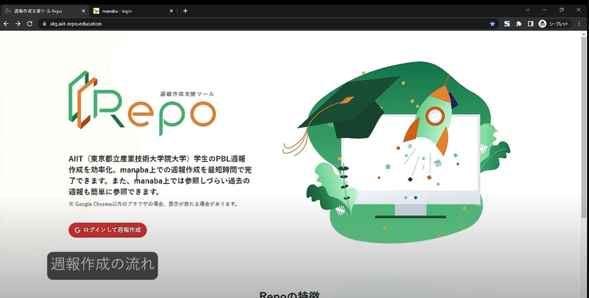
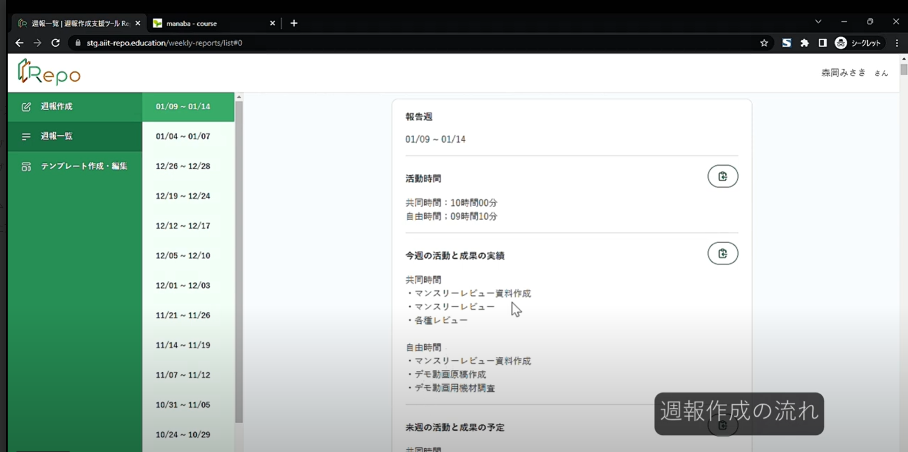

# repo

東京都立産業技術大学院大学のPBL（1年間にわたり取り組むプロジェクト型学習）で作成した、プロダクトになります。 
7名のチームメンバーで作成したため、全て私が作成したわけではありませんが、コードレビューを実施していたので 
担当外のコードの内容も、ある程度把握しています。

## 概要
東京都立産業技術大学院大学（AIIT）のPBL期間中に大学院へ提出する週報の作成支援を行うアプリケーション。 
価値のあるプロダクトにするため、ドッグフーディングをチームメンバーで行い、ブラッシュアップを行ってきました。 
プロジェクトの目標の一つとして、モダンな開発環境が設定され、テストコードの必須化やCI/CDの構築といった、 
環境の面からも学習を行うことができました。

### ランディングページ

### 週報履歴閲覧ページ

## 技術スタック
## フロントエンド
TypeScript、React、Next.js、ChakraUI、Cypress

## バックエンド
PHP、Laravel

