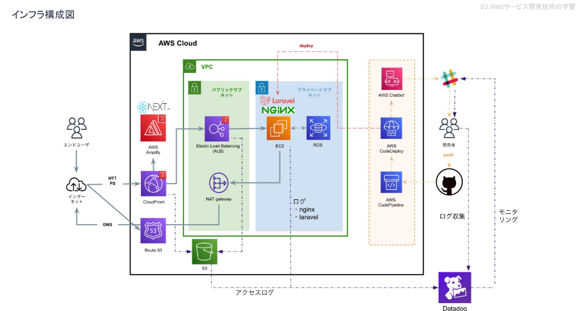

# Repo

東京都立産業技術大学院大学のPBL（1年間にわたり取り組むプロジェクト型学習）で作成した、プロダクトになります。
7名のチームメンバーで作成したため、全て私が作成したわけではありませんが、コードレビューを実施していたので
担当外のコードの内容も、ある程度把握しています。

## 概要
Repoとは、東京都立産業技術大学院大学（AIIT）の生徒がPBL期間中に大学院へ提出する週報の作成支援を行うアプリケーションです。 
価値のあるプロダクトにするため、ドッグフーディングをチームメンバーで行い、ブラッシュアップを行ってきました。 
API連携として、Laravel/Socialiteを使用したgoogle認証によるアカウント管理や、Slackを利用したリマインド機能を 
実装しました。 
また、プロジェクトの目標の一つとして、モダンな開発環境が設定し、テストコードの必須化やCI/CDを通して開発を行いました、 

### ランディングページ

### 週報履歴閲覧ページ

## 技術スタック

## インフラ構成図

